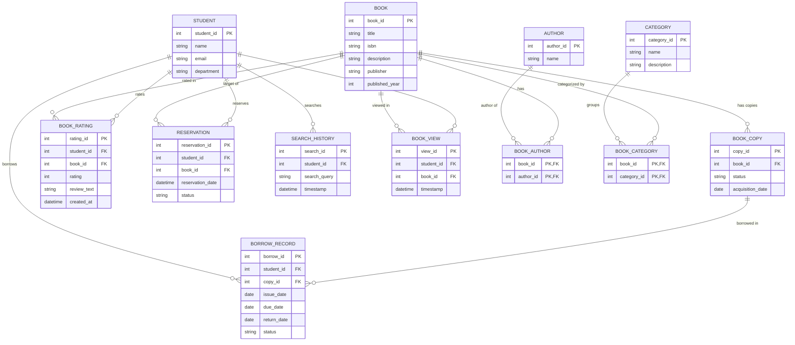

# Libra — Entity Relationship (ER) Diagram

This document contains the visual Entity Relationship diagram and schema breakdown for the **Libra** Smart Library & Recommendation System.

---

## 1. Visual ER Diagram (Mermaid)

---

## 2. Cardinality Summary

| Parent Entity | Relationship | Child / Related Entity | Description |
| :--- | :---: | :--- | :--- |
| **`STUDENT`** | `1 : N` | **`BORROW_RECORD`** | One student has many borrow transactions over time. |
| **`BOOK_COPY`** | `1 : N` | **`BORROW_RECORD`** | A physical copy can appear across multiple borrow histories (1 active at a time). |
| **`BOOK`** | `1 : N` | **`BOOK_COPY`** | One catalogue book title maps to multiple physical copies. |
| **`STUDENT`** | `N : M` | **`BOOK`** *(via `BOOK_RATING`)* | Students rate books; books receive ratings from many students. |
| **`STUDENT`** | `N : M` | **`BOOK`** *(via `RESERVATION`)* | Students reserve book titles; titles have multiple reservations. |
| **`STUDENT`** | `1 : N` | **`SEARCH_HISTORY`** | One student performs multiple query searches. |
| **`STUDENT`** | `N : M` | **`BOOK`** *(via `BOOK_VIEW`)* | Interaction signal recording when a student views a book. |
| **`BOOK`** | `N : M` | **`AUTHOR`** *(via `BOOK_AUTHOR`)* | Books can have multiple authors; authors can write multiple books. |
| **`BOOK`** | `N : M` | **`CATEGORY`** *(via `BOOK_CATEGORY`)* | Books can belong to multiple categories; categories group books. |

---

## 3. Key Design Notes

1. **Physical Copy vs. Conceptual Title**:
   - `BORROW_RECORD` points directly to `copy_id` (`BOOK_COPY`), reflecting physical inventory control.
   - `RESERVATION` points to `book_id` (`BOOK`), as students reserve any available copy of a title.
2. **Recommendation Signals**:
   - `SEARCH_HISTORY`, `BOOK_VIEW`, `BOOK_RATING`, `BORROW_RECORD`, and `RESERVATION` serve as interaction data points for training and evaluating collaborative/content-based filtering in the ML module.
